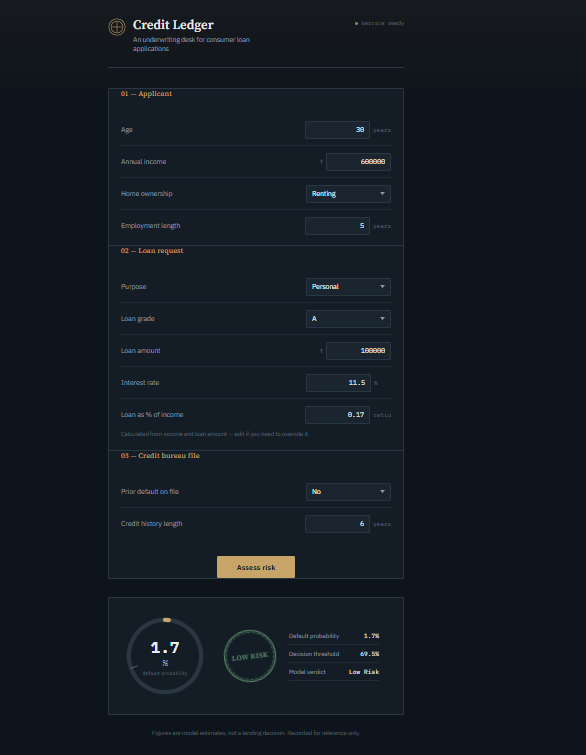

# 💳 Explainable Credit Risk Assessment

An end-to-end **Machine Learning Credit Risk Assessment system** that predicts whether a loan applicant is likely to default.

This project goes beyond simply training a classification model. It covers the complete ML workflow:

**EDA → Data Validation → Preprocessing → Class Imbalance Handling → Cross-Validation → Model Comparison → Hyperparameter Tuning → Threshold Optimization → Probability Calibration → SHAP Explainability → Error Analysis → FastAPI → Deployment**

The trained model is served through a FastAPI application and is available as a live deployed API.

---

## 🚀 Live Demo

🔗 **Live Application:** [Credit Risk Assessment API on Render](https://credit-risk-assesment-using-shap-elvu.onrender.com)

The deployed application allows users to submit loan applicant information and receive:

- Default probability
- Default prediction
- Risk classification
- Decision threshold

---


### 🖥️ Application Preview


---


## 🎯 Project Objective

The goal of this project is to build a practical credit-risk classification system that can:

1. Analyze applicant and loan information
2. Predict the probability of loan default
3. Handle class imbalance
4. Compare multiple classification models
5. Optimize model hyperparameters
6. Optimize classification thresholds
7. Calibrate predicted probabilities
8. Explain model predictions using SHAP
9. Analyze false positives and false negatives
10. Serve the trained model through a production-style API

---

## 📊 Dataset

The dataset contains **32,581 loan application records** across 12 features.

### Features

| Feature | Description |
|---|---|
| `person_age` | Age of the applicant |
| `person_income` | Annual income |
| `person_home_ownership` | Home ownership status |
| `person_emp_length` | Employment length |
| `loan_intent` | Purpose of the loan |
| `loan_grade` | Loan grade |
| `loan_amnt` | Loan amount |
| `loan_int_rate` | Loan interest rate |
| `loan_percent_income` | Loan amount as percentage of income |
| `cb_person_default_on_file` | Previous default indicator |
| `cb_person_cred_hist_length` | Credit history length |
| `loan_status` | Target variable |

### Target Distribution

- **`0`**: No Default (25,473 records)
- **`1`**: Default (7,108 records)

Because non-default cases outnumber default cases by roughly 3.6 to 1, addressing class imbalance is central to model training.

---

## 🔍 Project Workflow

### 1. Exploratory Data Analysis
Before modeling, exploratory data analysis was conducted to uncover underlying patterns and data quality issues:
- Dataset shape, structure, and data types
- Missing-value analysis (detected in `person_emp_length` and `loan_int_rate`)
- Target distribution and class imbalance ratios
- Outlier detection in numerical variables (notably `person_age` and `person_emp_length`)
- Feature correlation analysis and statistical summaries

### 2. Data Validation & Cleaning
A dedicated cleaning pipeline prepares raw inputs for modeling:
- Deduplication: Removed duplicate records, reducing the row count from **32,581** to **32,416**.
- Boundary checks: Filtered out unrealistic applicant ages, impossible employment lengths, and invalid loan amounts.
- Relationship validation across correlated financial indicators.

### ⚖️ 3. Handling Class Imbalance
Credit default is the minority class. To prevent the model from skewing toward majority predictions, class weighting is applied:

$$\text{Imbalance Ratio} = \frac{\text{Negative Samples}}{\text{Positive Samples}} \approx 3.63$$

This ratio is incorporated into both the Logistic Regression (`class_weight`) and XGBoost (`scale_pos_weight`) estimators.

### ⚙️ 4. Feature Preprocessing
Tailored preprocessing pipelines were built for each model architecture:

- **Logistic Regression Pipeline:**
  - *Numerical features:* Median Imputation $\rightarrow$ Standard Scaling
  - *Categorical features:* Most-Frequent Imputation $\rightarrow$ One-Hot Encoding
- **XGBoost Pipeline:**
  - *Numerical features:* Median Imputation (tree models do not require standard scaling)
  - *Categorical features:* Most-Frequent Imputation $\rightarrow$ One-Hot Encoding

### 🧪 5. Train-Test Split
- **Training Set:** 80%
- **Testing Set:** 20%
- Stratified sampling was applied to preserve class proportions across splits.

### 🔄 6. Stratified Cross-Validation
A 5-fold Stratified Cross-Validation strategy produced the following benchmarks:

| Model | ROC-AUC | Accuracy | Precision | Recall | F1 Score |
|---|---|---|---|---|---|
| **Logistic Regression** | 0.871 | 0.812 | 0.545 | 0.778 | 0.641 |
| **XGBoost** | 0.939 | 0.909 | 0.791 | 0.786 | 0.788 |

### 📌 7. Baseline Model — Logistic Regression
Logistic Regression serves as a linear baseline for comparison against non-linear models.

**Test Set Performance:**
- **Accuracy:** 0.82
- **Precision:** 0.56
- **Recall:** 0.79
- **F1 Score:** 0.65

### 🚀 8. XGBoost
XGBoost was chosen as the primary non-linear classifier to capture high-order feature interactions.

### 🔎 9. Hyperparameter Tuning
Hyperparameters were optimized using `RandomizedSearchCV` across 150 combinations with 5-fold cross-validation (750 fits total), using **Average Precision (PR-AUC)** as the scoring metric.

**Best Hyperparameters:**
```python
n_estimators       = 187
max_depth          = 6
learning_rate      ≈ 0.118
subsample          ≈ 0.977
colsample_bytree   ≈ 0.734
min_child_weight   = 6
gamma              ≈ 0.751
```
*Best CV Average Precision: $\approx 0.90$*

### 📈 10. Final XGBoost Performance
Evaluated on the held-out test set:

- **Accuracy:** 0.92
- **Precision:** 0.82
- **Recall:** 0.81
- **F1 Score:** 0.81

#### Classification Report

| Class | Precision | Recall | F1-Score |
|---|---|---|---|
| **No Default (0)** | 0.95 | 0.95 | 0.95 |
| **Default (1)** | 0.82 | 0.81 | 0.81 |

### 🎚️ 11. Classification Threshold Optimization
Rather than relying on the standard $0.50$ probability threshold, Precision-Recall curves were evaluated to select an optimal threshold that maximizes the F1 score, aligning model behavior with the asymmetric business costs of credit defaults.

### 🎯 12. Probability Calibration
To ensure raw output scores function as reliable default probabilities, `CalibratedClassifierCV` (with sigmoid calibration) was compared against uncalibrated outputs.

### 🧠 13. Explainable AI with SHAP
Model explainability is integrated via TreeSHAP:
- **Global Explainability:** SHAP summary and feature importance plots reveal overall key drivers (e.g., loan interest rate, loan-to-income ratio).
- **Local Explainability:** SHAP waterfall plots break down individual predictions to explain precisely why an applicant was accepted or flagged as high risk.

### 🚨 14. Error Analysis
Examining misclassifications on the held-out test set:
- **False Positives (242):** Predicted High Risk, actual Low Risk (lost business opportunity).
- **False Negatives (265):** Predicted Low Risk, actual High Risk (credit loss/bad debt).

---

## 🌐 15. FastAPI Deployment

The trained model is exposed via a production-style REST API built with FastAPI and validated using Pydantic.

### Input Schema
- `person_age`
- `person_income`
- `person_home_ownership`
- `person_emp_length`
- `loan_intent`
- `loan_grade`
- `loan_amnt`
- `loan_int_rate`
- `loan_percent_income`
- `cb_person_default_on_file`
- `cb_person_cred_hist_length`

### Endpoint: `POST /predict`

#### Example Request
```json
{
  "person_age": 28,
  "person_income": 60000,
  "person_home_ownership": "RENT",
  "person_emp_length": 5,
  "loan_intent": "PERSONAL",
  "loan_grade": "B",
  "loan_amnt": 10000,
  "loan_int_rate": 10.5,
  "loan_percent_income": 0.17,
  "cb_person_default_on_file": "N",
  "cb_person_cred_hist_length": 5
}
```

#### Example Response
```json
{
  "default_probability": 0.14,
  "default_prediction": 0,
  "threshold": 0.48,
  "Result": "Low Risk"
}
```

---

## 🏗️ Project Architecture

```
                    ┌─────────────────────┐
                    │   Loan Application  │
                    └──────────┬──────────┘
                               │
                               ▼
                    ┌─────────────────────┐
                    │      FastAPI        │
                    │  Pydantic Validation│
                    └──────────┬──────────┘
                               │
                               ▼
                    ┌─────────────────────┐
                    │ Pre-trained Model   │
                    │     XGBoost         │
                    └──────────┬──────────┘
                               │
                    ┌──────────┴──────────┐
                    │                     │
                    ▼                     ▼
             Default Probability    Classification
                    │                     │
                    └──────────┬──────────┘
                               ▼
                    ┌─────────────────────┐
                    │    Risk Result      │
                    │ High Risk / Low Risk│
                    └─────────────────────┘
```

---

## 📁 Project Structure

```
Credit-Risk-Assessment/
│
├── assets/
├── static/
│
├── Credit_Risk.ipynb
├── README.md
├── best_threshold.pkl
├── credit_risk_dataset.csv
├── credit_risk_model.pkl
├── main.py
├── render.yaml
├── requirements.txt
└── runtime.txt
```

---

## 🛠️ Tech Stack

- **Programming:** Python
- **Data Analysis:** Pandas, NumPy, Matplotlib, Seaborn
- **Machine Learning:** Scikit-learn, XGBoost, SciPy
- **Explainable AI:** SHAP
- **API & Validation:** FastAPI, Pydantic, Uvicorn
- **Model Serialization:** Joblib
- **Deployment:** Render

---

## 📚 Key Concepts Demonstrated

- Exploratory Data Analysis & Outlier Handling
- Data Cleaning & Preprocessing Pipelines
- Handling Class Imbalance with Cost-Sensitive Weights
- Stratified K-Fold Cross-Validation
- Non-linear Modeling & Hyperparameter Search
- Threshold Moving & Precision-Recall Trade-offs
- Probability Calibration (Platt Scaling / Sigmoid)
- Global & Local Interpretability (TreeSHAP)
- Post-Hoc Error Analysis
- Production Model Serving via FastAPI

---

## 💡 End-to-End Machine Learning Pipeline

```
Raw Data → EDA → Data Cleaning → Preprocessing → Class Imbalance Handling
         → Baseline Model → Tuned XGBoost → Threshold Tuning
         → Calibration → SHAP Interpretability → Error Analysis
         → Serialization → FastAPI Serving → Render Cloud Deployment
```

---

## ⚠️ Disclaimer

This project was built for educational and demonstration purposes. Model outputs should not be used as the sole basis for real-world underwriting or credit approval without additional validation, bias/fairness auditing, and regulatory compliance checks (e.g., Fair Lending / FCRA / ECOA regulations).

---

## 👨‍💻 Author

**Aadi**
